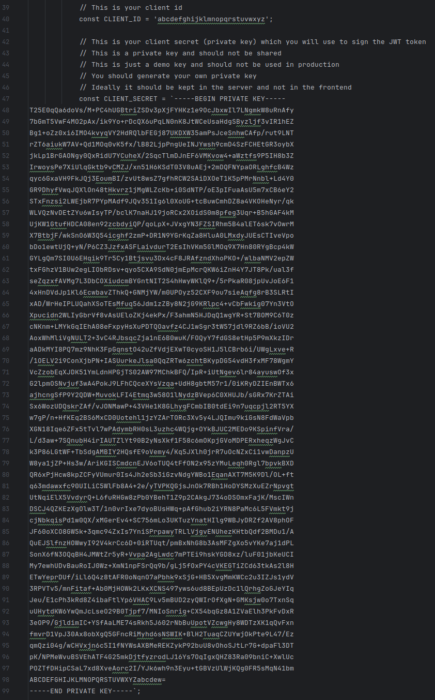

# basic-js

## Setting up auth

As this is a single page app, authentication with VPaaS is done on the client. Not for production use, but this is a
hackathon!

In `index.html`:
* Set `CLIENT_ID` to your clientID
* Set `CLIENT_SECRET` to the contents of your `privateKey.pem` file

Example of how this should look

## Running the sample

To run this sample, you can just open the file in a web browser (e.g. `file:///home/user/vpaas-hackathon-samples/basic-js/index.html`)
* Within 5-10 seconds, the browser should request your camera/microphone, and you'll see yourself.
* Copy-paste the URL to a new tab, and you should get a two-way video call.

## Troubleshooting

If it looks like nothing is happening, there is likely an error in the JavaScript console. Use `F12` to see what is wrong
